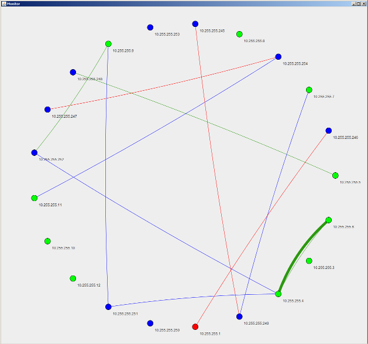

*book

*book is a distributed, self-healing, eventually-consistent messaging system with a social network-like interface.

# Overview

*book was developed to fulfill an assignment for a cloud computing class. The assignment was to create a social network using gossip protocols (specifically, the MiCA library). In theory, *book should be functional and efficient at cloud scale (thousands of nodes, millions of users), however it has only been actually tested on the order of a hundred nodes.

I wrote *book in about a month. It has rough edges, hard-coded parts that should be configuration, and generally needs optimization and other improvements if one were to seriously use it in production. It was written as a proof-of-concept MVP that uses gossip networking. That said, it does (or did) work as intended. A live demonstration was presented at BOOM 2012.

I couldn't come up with a clever alternative to the name Facebook that I liked--I had a long list of attempts--so ultimately I just used a wildcard (asterisk).

# Architecture

In general, the architecture consists of a set of nodes which communicate to each other, the users and DNS. There are three types of nodes: index, web and worker, and the nodes use both gossip protocols and direct messaging (UDP and TCP) to communciate with each other.

Every user is assigned to multiple nodes where their data will be stored and replicated. The system maintains a minimum number of these replicas as nodes come and go. DNS is kept up-to-date with these assignments, so a user can access any of their assigned web nodes to view their feed (or use a single load-balanced DNS name, etc.).

## Node Types

### Index Node

The index node stores user information on disk, assigns new users to nodes, and keeps DNS up-to-date with user-node assignments.

### Web Node

Caches messages for assigned users, serves web site requests and accepts (and gossips) new messages from users.

### Worker Node

Durably stores messages on disk and listens for message gossip in order to replicate messages.

## Protocols

### Message Discovery Protocol

The message discovery protocol is used between web and worker nodes. This protocol replicates/caches stored messages and exchanges newly-submitted messages from users.

### Node Discovery Protocol

The node discovery protocol is used by every node and exchanges node existence information. Currently, every node knows about the existence of every other node.

### User Discovery Protocol

The user discovery protocol is used between web and index nodes. This protocol exchanges user subscription information so web nodes know which messages to cache.

# Monitor

I also wrote a monitoring application which listens to the network traffic and/or direct messages from nodes and displays that is happening in the network in near real-time.
